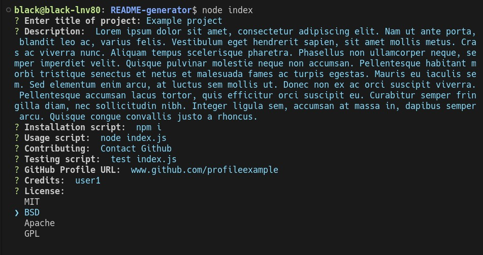
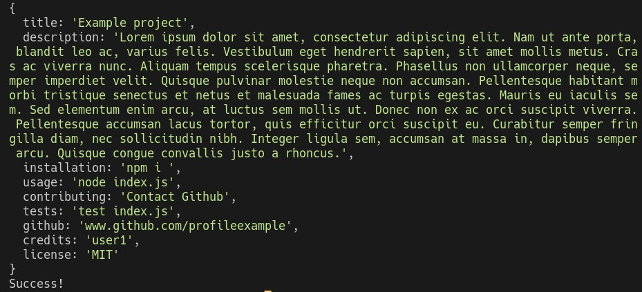
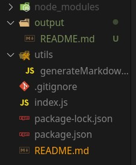
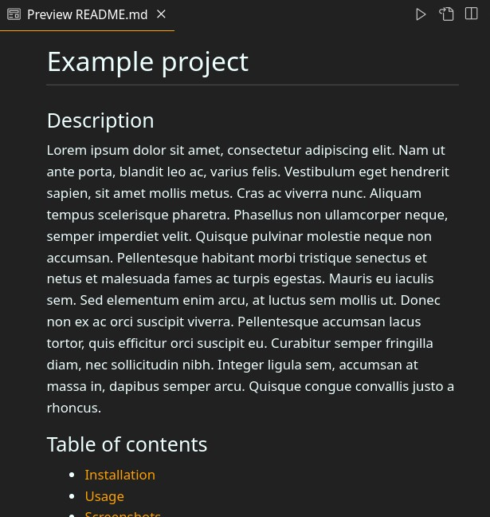
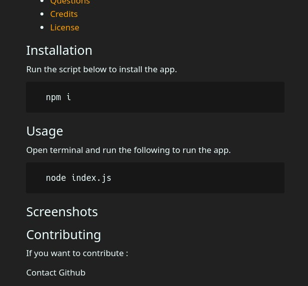
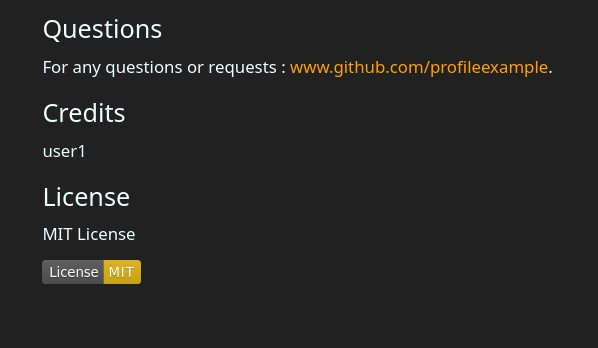

# Example project

## Description
Lorem ipsum dolor sit amet, consectetur adipiscing elit. Nam ut ante porta, blandit leo ac, varius felis. Vestibulum eget hendrerit sapien, sit amet mollis metus. Cras ac viverra nunc. Aliquam tempus scelerisque pharetra. Phasellus non ullamcorper neque, semper imperdiet velit. Quisque pulvinar molestie neque non accumsan. Pellentesque habitant morbi tristique senectus et netus et malesuada fames ac turpis egestas. Mauris eu iaculis sem. Sed elementum enim arcu, at luctus sem mollis ut. Donec non ex ac orci suscipit viverra. Pellentesque accumsan lacus tortor, quis efficitur orci suscipit eu. Curabitur semper fringilla diam, nec sollicitudin nibh. Integer ligula sem, accumsan at massa in, dapibus semper arcu. Quisque congue convallis justo a rhoncus.


## Table of contents
- [Example project](#example-project)
  - [Description](#description)
  - [Table of contents](#table-of-contents)
  - [Installation](#installation)
  - [Usage](#usage)
  - [Screenshots](#screenshots)
  - [Contributing](#contributing)
  - [Tests](#tests)
  - [Questions](#questions)
  - [Credits](#credits)
  - [License](#license)


## Installation 

Run the script below to install the app.
```
  npm i 
```


## Usage

Open terminal and run the following to run the app.
```
  node index.js
```


## Screenshots









## Contributing

If you want to contribute : 

Contact Github

## Tests

Run the following script for testing:
```
  test index.js
```

## Questions

For any questions or requests : [www.github.com/profileexample](https://www.github.com/profileexample).

## Credits

user1


## License 

MIT License

[](https://opensource.org/licenses/MIT)
  
